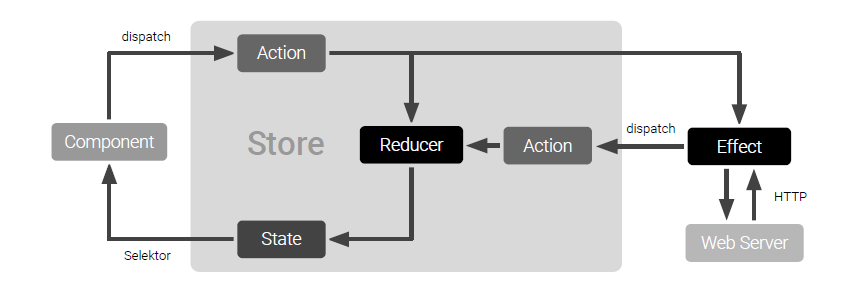

# Using a **NgRx** for State Management in Angular - Counter example

### Summarise the idea
What is application state? Theoretically, it is the entire memory of the application, but, typically, it is the data received via API calls, user inputs, presentation UI State, app preferences, etc. Simply put, it is the data that can differentiate two instances of the same application.

### NgRx App State Management
- Let’s look at the NgRx implementation — there are several components to understand. 

### Store
Store is what holds the app's state.

### Action
A unique event dispatched from components and services that describe how the state should be changed. For example, ‘Add Customer’ can be an action that will change the state (i.e. add a new customer to the list).
- **type:** It’s a read only string describing what the action stand for. For example: ‘[User] Get User Name’
- **payload:** The type of this property depends on what type of data this action needs to send to the reducer. In the case of the previous example, is going to be a string containing the user name. Not all actions needs a payload.

### Reducer
All the state changes happen inside the reducer; it responds to the action and, based on that action, it will create a new immutable state and return it to the store.*

### Selector
Selector is a function used for obtaining a part of the state from the store.

### Effect
A mechanism that listens for dispatched actions in an observable stream, processes the server response, and returns new actions either immediately or asynchronously to the reducer to change the state. Please note that we are not using effect in this example app.

# Angular CLI

This project was generated with [Angular CLI](https://github.com/angular/angular-cli) version 8.3.19.

## Development server

Run `ng serve` for a dev server. Navigate to `http://localhost:4200/`. The app will automatically reload if you change any of the source files.

## Code scaffolding

Run `ng generate component component-name` to generate a new component. You can also use `ng generate directive|pipe|service|class|guard|interface|enum|module`.

## Build

Run `ng build` to build the project. The build artifacts will be stored in the `dist/` directory. Use the `--prod` flag for a production build.

## Running unit tests

Run `ng test` to execute the unit tests via [Karma](https://karma-runner.github.io).

## Running end-to-end tests

Run `ng e2e` to execute the end-to-end tests via [Protractor](http://www.protractortest.org/).

## Further help

To get more help on the Angular CLI use `ng help` or go check out the [Angular CLI README](https://github.com/angular/angular-cli/blob/master/README.md).
